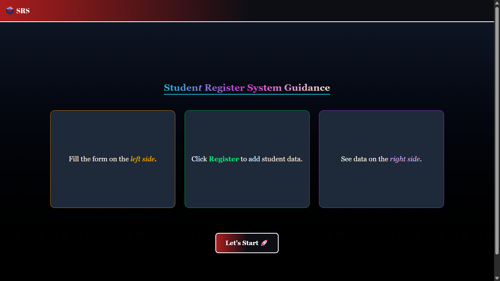
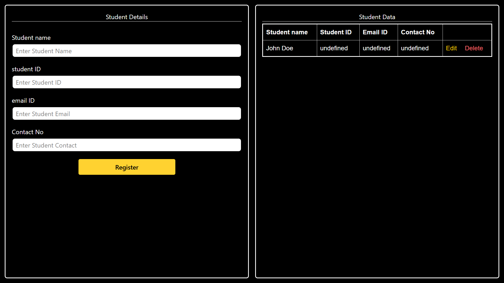

#  Student Registration System

A responsive and interactive web application that allows users to register student details, display them dynamically, update or delete entries, and persist data using **Local Storage**.

---

## 📸 Screenshots

### 🖼️ Form & Table Interface


### 🖼️ Dashboard Display


---

## 🔧 Features

- 📋 Register student details (name, ID, email, contact)
- 🗃️ View all registered students
- ✏️ Edit student entries
- 🗑️ Delete specific students
- 💾 Persistent data with `localStorage`
- 📱 Responsive design for mobile and desktop
- 🎨 Interactive UI with Tailwind CSS animations

---

## 🚀 Getting Started

1. Clone the repo:
   ```bash
   git clone https://github.com/your-username/student-register-system.git
